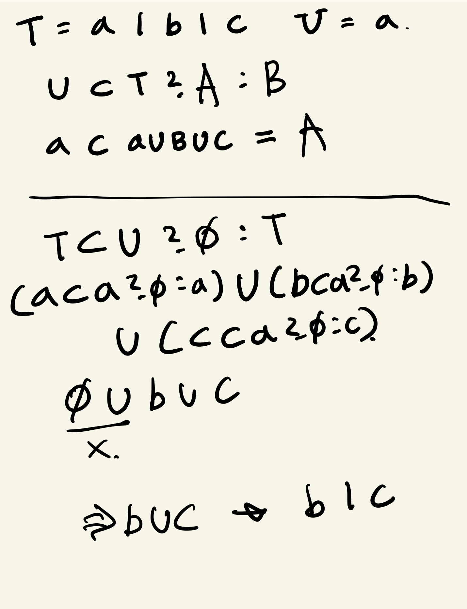

# Exclude

<aside>
💡 `T`에서 `U`에 할당할 수 있는 타입을 제외하는 내장 제네릭 `Exclude<T, U>`를 이를 사용하지 않고 구현하세요

</aside>

```tsx
// 내 시도
{
    type MyExclude<T, U> = U extends T ? "T에서 U를 빼줘야 하는데...." : T;

    type Result = MyExclude<"a" | "b" | "c", "a">; // "T에서 U를 빼줘야 하는데...."
}

// 정답 확인
{
    type MyExclude<T, U> = T extends U ? never : T;

    type Result = MyExclude<"a" | "b" | "c", "a">; // 'b' | 'c'
}
```

-   해결 방법
    -   나는 `U (두번째로 넣는 타입)` 이 `T (첫번째로 넣는 타입)` 에 부분집합이면으로 시작했는데 잘못됐다.
        -   당연히 부분집합이니 `"T에서 U를 빼줘야 하는데...."` 가 나옴..
    -   이 문제에서 기억해야 할것!
        -   `T extends U ?` 에서 `T`가 제네릭 타입이면 분배법칙이 적용된다!!!!
        -   풀이식
            
